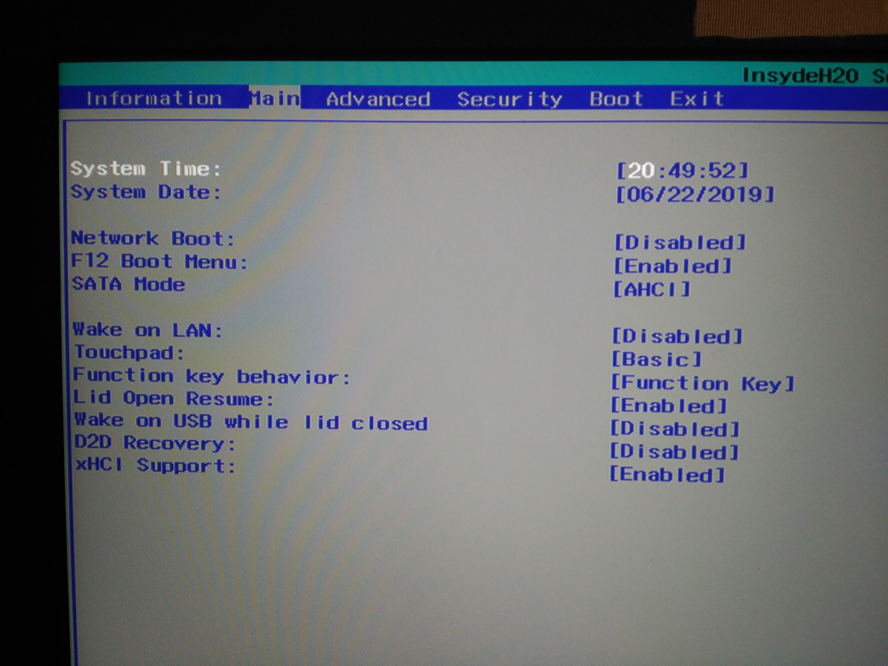

 
La instalación de debian en portátiles nuevos puede ser un poco complicada debido al UEFI, es por ello que comparto la experiencia instalando Debian (finalmente la versión 10) en el `Acer Nitro 5 an515-52-5336` a mi manera.

## Descargar ISOs

En primer lugar descargaremos Debian 10 de la página oficial, que es la versión estable actualmente (cuando hice este archivo era el testing, por lo que se modificará todo para dejar los pasos actualizados). Tiene que ser esta porque es la que posee soporte para UEFI, las anteriores no tienen. Lo podemos descargar de:  
[Estable](https://www.debian.org/) y descargar la versión estable netinstall oficial que viene.  
[Testing](https://cdimage.debian.org/cdimage/weekly-builds/amd64/iso-cd/) y descargar debian-testing-amd64-netinst.iso que es debian 11 bullseye  
Con el netinstall se requiere conexión a internet a la hora de la instalación, pero se descarga más rápido la iso porque pesa muy poco. O bien descargar versiones más completas como la DVD1 que no necesita conexión a internet durante la instalación.  
[Descarga DVD 1 estable](https://www.debian.org/devel/debian-installer/)

Utilizo la rama testing porque así tengo la posibilidad de utilizar paquetes más nuevos de los programas, aún llamándose testing, es bastante estable y seguro para entornos domésticos (utilizaba debian 10 buster testing, y cuando pasó a ser estable, seguí con testing así que estoy con debian 11 bullseye).

## Grabar en PenDrive

Ya descargado, tenemos que grabarlo en un pendrive, el mejor programa para grabar imagenes iso de linux desde cualquier sistema operativo es [Etcher](https://www.balena.io/etcher/). También se puede utilizar desde windows [Rufus](https://rufus.ie/).

Una vez tengamos la iso, el programa, y un pendrive, procedemos a grabar la imagen, para ello dejamos puesto el pendrive.  
Desde ambos programas, se debería seleccionar automáticamente el pendrive, si no es donde queremos grabar la iso, abrimos el desplegable y selecciona tu dispositivo. Luego en el botón seleccionar buscaremos la iso.  
Una vez puesta, en Etcher se pisa en `Flash!`.  
En Rufus seleccionamos esquema de partición GPT, y en sistema destino UEFI. Y pisar comenzar.

## Arrancar el PenDrive en PC

Cuando esté listo, quitamos el pendrive y lo metemos en el pc que queramos formatear estando apagado y con el cable de red puesto, menos líos que con el wifi.

En este portatil finalmente necesité activar el `secure boot` y establecer una contraseña de UEFI para poder instalar distribuciones linux con UEFI. En caso contrario no funcionaba. Para ello mientras se enciende, pisamos F2 hasta que entremos en la UEFI, y se realizan esos dos pasos.

Hecho lo anterior, debemos iniciar el pendrive, para ello desde el mismo UEFI en el apartado boot, colocamos el pendrive en primera posición. Guardamos los cambios y reiniciamos.

Al reiniciar debería salir un menú en el que podemos seleccionar varios apartados, o bien instalación gráfica (con ratón), como normal (solo teclado). Elegid el que más os guste, yo utilizo la normal.

Es un instalador de todo siguiente prácticamente, en el que hay que elegir las opciones que sean adecuadas para cada uno, usuario, contraseñas, huso horario, interfaz a utilizar, etc. Y ya estaría instalado.

[Mi Manera de instalar la interfaz gráfica.](InstalarKDE.md)