# Instalación VirtualBox

VirtualBox es un programa que permite la virtualización de un sistema operativo, es decir, como si se tuviera un ordenador dentro de otro. Hay que cumplir un requisito y es tener activada la virtualización en la BIOS. Hoy en día prácticamente todos los cpu y placas soportan esta tecnología, pero es necesario asegurarse de que la tiene y además activarla. Para cada placa será distinto, pero será algo parecido a lo siguiente, buscando las opciones `virtualization`, y todas las que empiecen por `VT-`. O equivalente en AMD.

Para descargarlo se puede hacer a través de su pagina web.

https://www.virtualbox.org/

En windows será descargar el exe correspondiente e instalarlo con todo siguiente.

En debian 10 se descarga el archivo y se puede utilizar `sudo apt install ./archivo.deb`.

Para el resto de distribuciones, descargar el archivo correspondiente y seguid las instrucciones para instalar paquetes con la extensión que venga, buscando en internet. Si está en los repositorios de la distribución, se puede instalar desde ahí.

Una vez instalado, se tendrá una ventana como esta en la versión 6.1 actualmente.

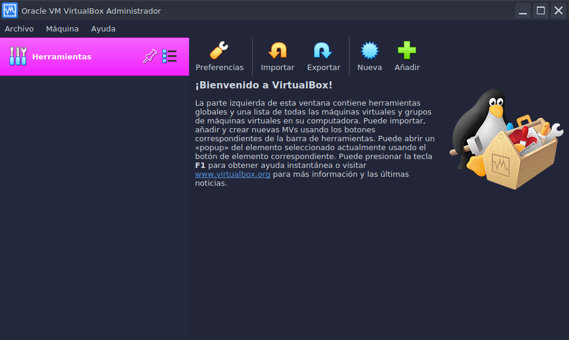

Ahora es necesario instalar el `Extension pack`, se descarga desde su web también, está un poco más abajo de la descarga normal del programa.

Una vez descargado, si está `VirtualBox` instalado, se le puede dar doble clic, y darle todo siguiente al instalador.

También se puede añadir a mano desde las preferencias del programa.

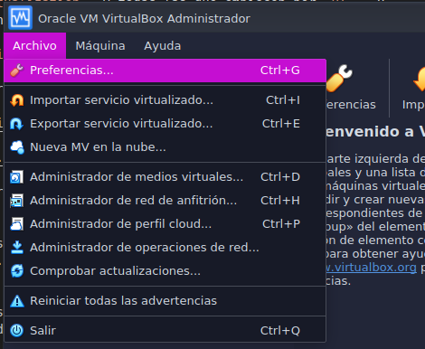

Y desde el botón de la suma, buscar el archivo e instalarlo.

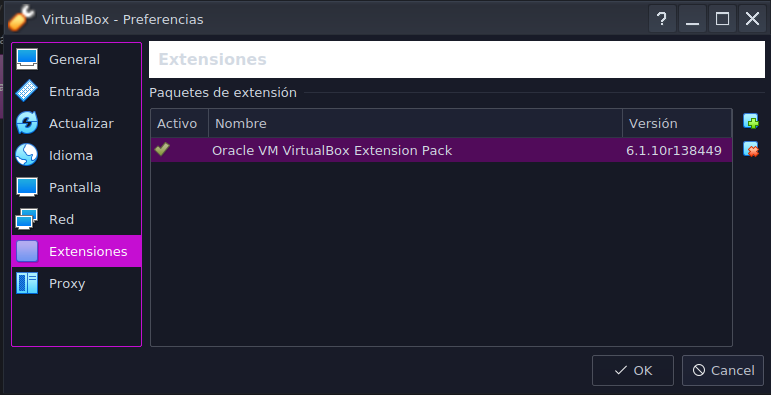

# Instalación de una máquina virtual en VirtualBox

Una vez instalado, se presupone que con todo funcionando, se podrán crear las máquinas virtuales que contendrán los sistemas operativos. Y es que cada "máquina virtual" que se crea, es como un pc, su hardware, pero sin sistema operativo, con lo que hay que tener la ISO del sistema operativo, añadirla, ejecutar el proceso de instalación a mano y finalmente se tendrá "una máquina virtual con un sistema operativo ejecutándose", abreviado en "una máquina virtual ejecutándose".

Cuando se crea una máquina virtual, se puede elegir el sistema operativo que se instalará en ella, y esto no es para una instalación automatizada del sistema operativo, sino para que el programa de VirtualBox optimice el hardware virtual para ese sistema operativo. Pero esto no quiere decir que no se pueda instalar otro sistema operativo distinto. Se puede designar una máquina virtual como windows, instalarle linux y al contrario también.

Lo primero que se debe hacer es crear una nueva máquina virtual, para ello se hace clic en el botón de `Nueva`.

Aparecerá una ventana que es el asistente. El modo asistente es para tener todos los pasos del asistente básico en una sola ventana

La primera opción es para colocar el nombre de la máquina virtual, puede ser lo que se quiera. 

La segunda opción es para ubicar los archivos de configuración de la máquina virtual.

La tercera y cuarta es para elegir un sistema general, y un sistema operativo concreto respectivamente.

La siguiente ventana es para asignar cuanta memoria RAM de nuestro pc normal, se le va a dar a esta máquina virtual. Algo recomendable es que nuestro pc real (host) al menos, siempre tenga RAM suficiente para funcionar holgadamente, todo dependerá de la RAM instalada y del uso de la máquina virtual. Si se tienen 8GB, se le puede asignar a la máquina virtual HASTA 4GB sin preocuparse, que se puede poner menos, si es un linux la máquina virtual, con 1GB irá bien normalmente, si es un windows, intentar que al menos tenga 2GB. Si se tienen 32GB instalados, pues se le podría poner hasta 26GB o así, pero lo normal es que con unos pocos gb sea suficiente por cada máquina virtual. Pero todo depende del uso.

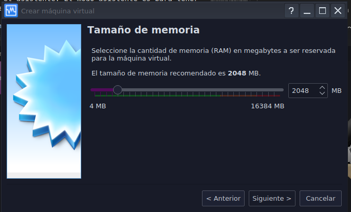

La siguiente ventana es para asignarle el disco duro (virtual) a la máquina virtual.

La primera opción es para no ponerle ninguno, si se tiene planeado añadirlo más adelante.

La segunda opción será lo más común, y es crear uno nuevo en el momento.

La tercera es para elegir uno ya creado. Se especifica la ruta y ya.

En este caso se escogerá la opción de crear uno nuevo.

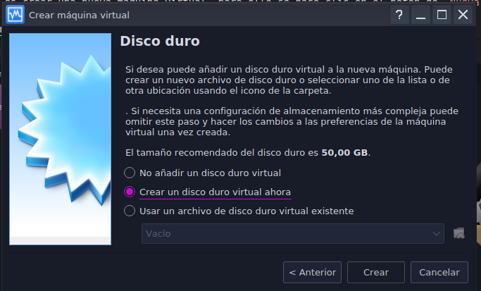

La ventana que aparece por haber querido crear un disco duro, nos permite elegir distintos formatos, con la primera, que viene por defecto, todo irá bien.

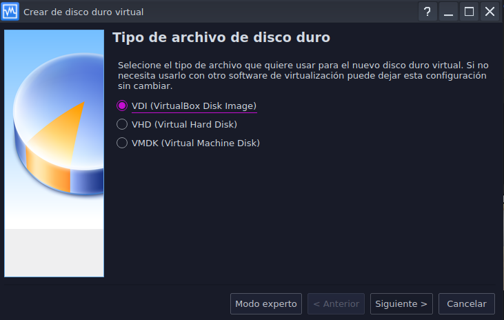

La siguiente ventana es una decisión importante y hay que saber elegir cual en cada circunstancia. El disco duro virtual es un archivo que actuará como disco duro para la máquina virtual y llegará a ocupar con el tiempo, o desde el principio (según elección) el tamaño final, por lo tanto si el disco duro es de 500GB, no se puede poner una cantidad mayor a esta, ni siquiera igual, depende del espacio libre que haya en el disco duro.

Si se está haciendo pruebas, si se tiene capacidad limitada de disco duro real, algún aspecto limitante en tu ordenador, si se quiere copiar rápidamente el archivo a otros sitios o simplemente no se quiere que ocupe todo el espacio desde el principio, elige `Reservado dinámicamente`. Esto permite que VirtualBox empiece a usar un disco duro virtual de pequeño tamaño y se va agrandando poco a poco cuando lo va necesitando, hasta un máximo que se pondrá en la siguiente ventana.

En caso contrario, se puede utilizar tamaño fijo.

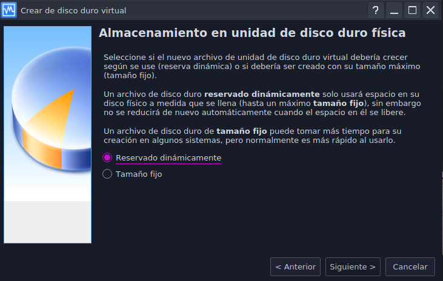

La siguiente ventana permite elegir la ubicación del disco duro y el tamaño que tomará finalmente.

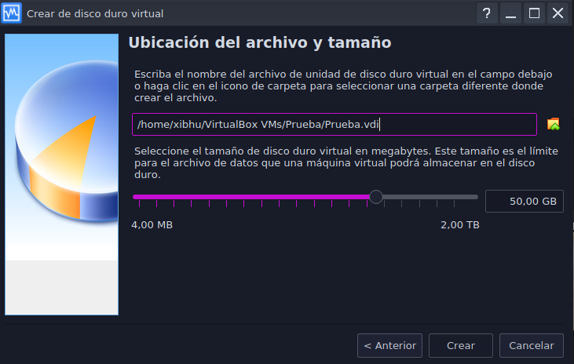

Una vez se le da a crear, termina el proceso de crearción de la máquina virtual, ahora se tiene un hardware virtual al que se le puede instalar un sistema operativo.

# Configuración de una máquina virtual

Cuando se termina el proceso de creación, ahora aparecerá en el menú principal de VirtualBox una nueva máquina virtual, con el nombre que se le haya puesto, y una configuración por defecto. Esa configuración se va a tocar ANTES de instalar el sistema operativo. Estas opciones pueden variar según el sistema operativo que se esté instalando, se puede buscar más información en internet.

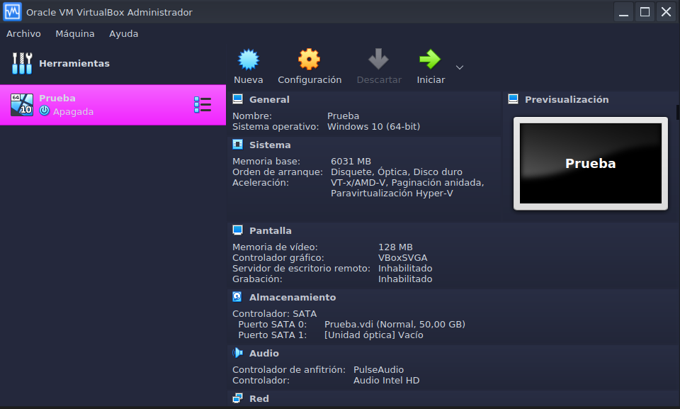

Para ello se pisa en el botón de `Configuración`. Con lo que aparecerá una ventana con muchos apartados. En esta primera se puede poner en la pestaña `Avanzado` las opciones `bidireccional`. Esto sirve para que si los sistemas lo permite, arrastrar archivos del pc real al virtual y el copiar pegar texto funcione de una a otra.

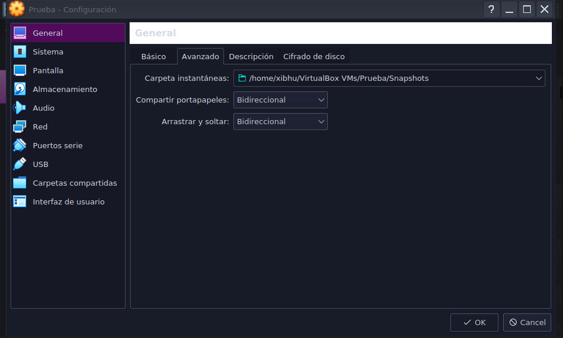

En el apartado de `sistema - placa base` se puede cambiar el orden de arranque y quitar el disquete y el óptico.

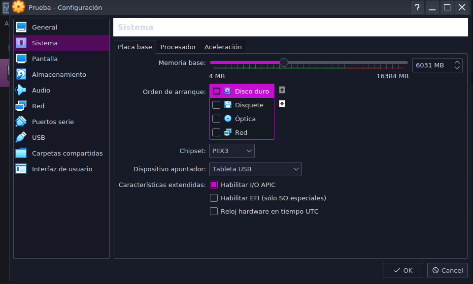

En el apartado de `sistema - procesador` se pueden añadir varios núcleos de la cpu para que los utilice la máquina virtual. Siempre hay que dejar libres para el sistema real.

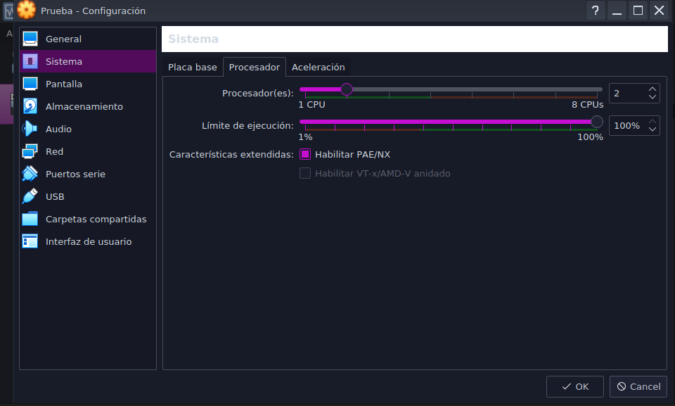

En el apartado de 